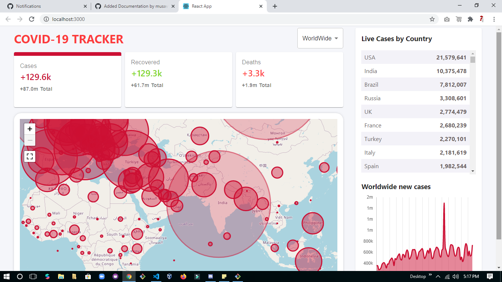

# World-Covid-Tracker 🤧😷📝

<!-- ALL-CONTRIBUTORS-BADGE:START - Do not remove or modify this section -->

<strong> A World Covid Tracking site made completely on ReactJs, Firebase. The site shows data of confirmed, recovered and deaths of all the countries plotted on a world map. It also has some cool animations showing the top affected countries. </strong>

## Before doing anything visit deployed App <a href="https://covid-19-tracker-2c77b.web.app/">Covid Tracker </a>

## Tech Stack 🗃

    

## How to contribute ?

- Follow Contributon Guidelines mentioned [here](https://github.com/Saikat-98/World-Covid-Tracker/blob/main/CONTRIBUTING.md)

## Demo ## How to contribute ?

 - Follow Contributon Guidelines mentioned [here](https://github.com/Saikat-98/World-Covid-Tracker/blob/main/CONTRIBUTING.md)

## Getting Started 👨‍💻

### Setup the repository to your local environment.

1. `fork` the repository , Creates a replica of repository to your local environment.
2. `git clone https://github.com/YOUR-USERNAME/World-Covid-Tracker` Downloads all repo files to your machine.
3. `cd World-Covid-Tracker` Takes you to the root directory of the project.

## Frontend ⚛️

Following are the steps to run the frontend of the World-Covid-Tracker. All the frontend code will go in the `frontend` directory.

1. Run `npm install`. It will install all the required packages and dependencies.
2. Run `npm start` to run the server.
3. Navigate to [http://localhost:3000](http://localhost:3000) to view it in the browser.

## Backend 💻

1. Firebase is used

## Programs We have been associated with 🤍

## Contributors 🌟

Thanks goes to these wonderful people ✨✨:

